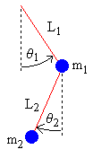
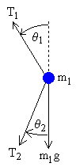
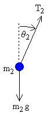

[Source](https://web.mit.edu/jorloff/www/chaosTalk/double-pendulum/double-pendulum-en.html)

#### Derivação da aceleração

A partir de simples trigonometria, as posições de cada massa:

$$
x_1 = L_1 \sin{\theta_1}\\
y_1 = -L_1 \cos{\theta_1}
$$

$$
x_2 = x_1 + L_2 \sin{\theta_2}\\
y_2 = y_1 - L_2 \cos{\theta_2}
$$

A velocidade será a derivada da posição com respeito ao tempo.

Sabendo que L1 e L2 são constantes, mas $\theta$ é uma função do tempo, aplicaremos a regra da cadeia:

$$
\frac{d}{dx}[f(g(x))] = f'(g(x))g'(x)
$$

$$
x_1' = \theta_1' L_1 \cos{\theta_1}\\
y_1' = \theta_1' L_1 \sin{\theta_1}
$$

$$
x_2' = x_1' + \theta_2' L_2 \cos{\theta_2}\\
y_2' = y_1' + \theta_2' L_2 \sin{\theta_2}
$$

A aceleração é então a derivada de segunda ordem:

Lembrando a regra do produto:

$$
\frac{d}{dx}[f(x)g(x)] = f'(x)g(x) + f(x)g'(x)
$$

$$
x_1'' = L_1 (\theta_1''\cos{\theta_1} + \theta_1'(-\sin{\theta_1})\theta_1')
\\
= -\theta_1'^{2}L_1\sin{\theta_1} + \theta_1''L_1\cos{\theta_1}\\
$$

$$
y_1'' = L_1 (\theta_1''\sin{\theta_1} + \theta_1'(\cos{\theta})\theta_1')
\\
= \theta_1'^{2}L_1\cos{\theta_1} + \theta_1''L_1\sin{\theta_1}
$$

$$
x_2'' = x_1'' + L_2 (\theta_2''\cos{\theta_2} + \theta_2'(-\sin{\theta_2})\theta_2')
\\
= x_1'' -\theta_2'^{2}L_2\sin{\theta_2} + \theta_2''L_2\cos{\theta_2}\\
$$

$$
y_2'' = y_1'' + L_2 (\theta_2''\sin{\theta_2} + \theta_2'(\cos{\theta})\theta_2')
\\
= y_1'' +\theta_2'^{2}L_2\cos{\theta_2} + \theta_2''L_2\sin{\theta_2}
$$

#### Desenhando o diagrama do corpo livre para as duas massas:

##### Massa superior

Tratando as forças horizontais e verticais independentemente, pode-se relacioná-las à aceleração horizontal e vertical $x_1''$ e $y_1''$ descritas nas equações anteriores. Descrevendo a força resultante então, com a primeira lei de Newton:

A tensão terá componentes verticas e horizontais, enquanto a peso só atuará verticalmente.

###### Forças horizontais (massa superior):

$$m_x a_x = F_x$$

$$
m_1x_1'' = -T_1\sin{\theta_1} + T_2\sin{\theta_2}
$$

Note que uma componente é negativa e a outra positiva pois o sinal do ângulo se da em função de estar em sentido horário ou anti-horário. Por tanto, $\theta_2 <0$ e $\sin{\theta_2 < 0}$. Então, a componente é negativa, refletindo em sua direção para a esquerda. Na outra, o ângulo é positivo, mas o sinal é negativo. Isso se dá pois elas são espelhadas pelo eixo horizontal.

###### Forças verticais (massa superior):

$$
m_1y_1'' = T_1\cos{\theta_1} - T_2\cos{\theta_2} - m_1g
$$

##### Massa inferior:

$$
m_2x_2'' = -T_2 \sin{\theta_2}\\
m_2y_2'' = T_2 \cos{\theta_2} - m_2g
$$
